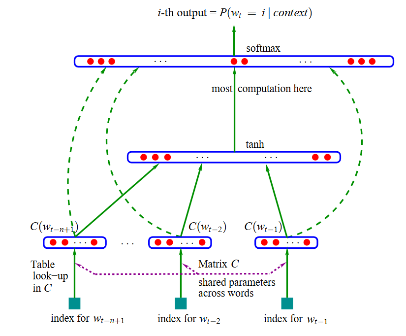

# Tổng quan về Word2Vec

## 1. Nguồn gốc

Word2Vec là một phương pháp word embedding được trình bày trong bài báo "Efficient Estimation of Word Representations in Vector Space"[1](https://arxiv.org/abs/1301.3781) bởi Tomas Mikolov và cộng sự (Google) vào năm 2013. Tuy phương pháp biểu diễn từ dưới dạng các vector liên tục đã bắt đầu manh nha từ trước thời điểm công bố của bài báo, nhưng sự ra đời của Word2Vec là một cột mốc đáng nhớ để đánh dấu cho sự bùng nổ và phát triển của phương pháp word embedding. 

Word2Vec được lấy cảm hứng từ kiến trúc của mô hình NNLM (Neural Network Language Model) được Yoshua Bengio cùng cộng sự trình bày trong bài báo[2](https://www.jmlr.org/papers/volume3/bengio03a/bengio03a.pdf) vào năm 2003. Như bao mô hình ngôn ngữ khác, NNLM được thiết kế để học phân phối xác suất từ dữ liệu text và được ứng dụng cho bài toán sinh văn bản (Text generation). 

## 2. Mô hình NNLM

  
  
<em>Hình 1: Kiến trúc của mô hình Neural Network Language Model (NNLM)</em>

